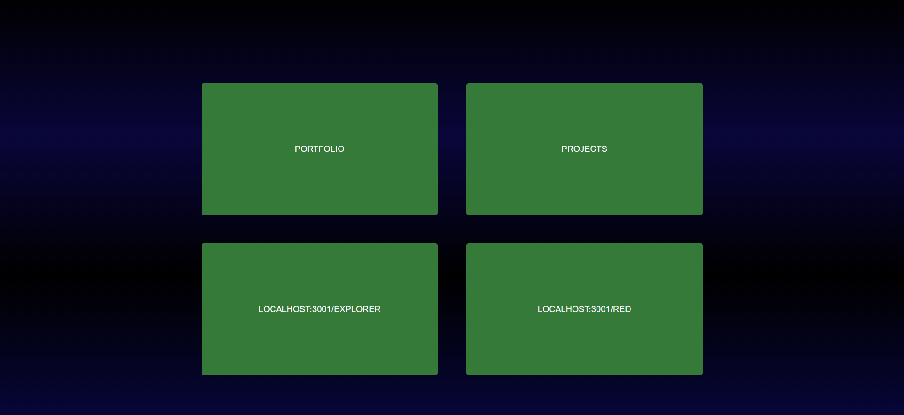

# Portfolio
Portfolio programmed with React and example project using Loopback MySQL as backend

Portfolio section shows my frontend skills and gives an description of me

Projects section show how i can handle Rest Api/Backend 

Main point in the projects section:

* Data model relations
* End points
* How to fecth/display data effectively 

## How to run
git clone: https://github.com/NurroMikael/Portfolio.git

cd Portfolio/backend 

Run npm install

npm start

cd ..

cd frontend

npm install

npm start

## Frontpage
Run backend first and then frontend

You can checkout Loopback´s built-in Explorer via Frontpage

You can also use NodeRed in this project!

